# Zenith Wallet Hub - Project Scope Analysis

## Overview

**Zenith Wallet Hub** (also branded as "Expensiver") is a comprehensive full-stack expense management and digital wallet application. The project implements a dual-mode system supporting both personal finance management and collaborative group expense sharing.

**Repository Type**: Full-Stack Application  
**Architecture**: Modern MERN Stack with TypeScript frontend

## Technology Stack & Dependencies

### Backend Architecture
- **Runtime**: Node.js with ES modules
- **Framework**: Express.js 4.18.2
- **Database**: MongoDB with Mongoose ODM 8.0.3
- **Authentication**: JWT with bcryptjs hashing
- **Security**: Helmet, CORS, Rate limiting
- **File Upload**: Multer with Cloudinary integration
- **Email**: Nodemailer
- **Real-time**: Socket.io 4.7.4

### Frontend Architecture
- **Framework**: React 18.3.1 with TypeScript
- **Build Tool**: Vite 5.4.19
- **UI Library**: Radix UI primitives with shadcn/ui
- **Styling**: Tailwind CSS with custom design system
- **State Management**: TanStack Query for server state
- **Routing**: React Router DOM 6.30.1
- **Forms**: React Hook Form with Zod validation
- **Charts**: Recharts 2.15.4
- **QR Features**: ZXing Library & QRCode generation

## Data Models & ORM Mapping

### User Model
```
User {
  - Personal Info: name, email, phone, avatar, dateOfBirth
  - Address: street, city, state, zipCode, country
  - Preferences: currency, language, timezone, notifications
  - Financial: walletBalance, upiAccounts[], bankAccounts[]
  - Security: twoFactorEnabled, biometricEnabled, sessionTimeout
  - Groups: groups[] (ObjectId references)
  - Verification: isEmailVerified, isPhoneVerified
  - Tokens: passwordResetToken, emailVerificationToken
}
```

### Expense Model
```
Expense {
  - Basic: title, description, amount, currency, category
  - Ownership: paidBy (User), group (Group), type (personal/group)
  - Splitting: splitType (equal/percentage/custom/shares)
  - Participants: [{user, amount, percentage, shares, settled}]
  - Attachments: receipts[], notes[], tags[]
  - Location: name, address, coordinates
  - Recurring: isRecurring, recurringPattern
  - Settlement: status, approvals[], settlement{}
}
```

### Group Model
```
Group {
  - Basic: name, description, avatar, currency, privacy
  - Ownership: owner (User), members[]
  - Members: [{user, role, joinedAt, balance, status}]
  - Settings: allowMemberInvites, autoSettlement, memberLimit
  - Activity: totalExpenses, settlements[], invitations[]
  - Access: joinCode, lastActivity
}
```

## API Endpoints Reference

### Authentication Flow
- `POST /api/auth/register` - User registration with email verification
- `POST /api/auth/login` - JWT-based authentication
- `POST /api/auth/refresh` - Token refresh mechanism
- `POST /api/auth/logout` - Session termination
- `GET /api/auth/me` - Current user profile

### User Management
- `GET /api/users/profile` - User profile retrieval
- `PUT /api/users/profile` - Profile updates
- `POST /api/users/upi-accounts` - UPI account management
- `GET /api/users/search` - User discovery for invitations

### Group Operations
- `GET /api/groups` - User's group memberships
- `POST /api/groups` - Group creation with settings
- `GET /api/groups/:groupId` - Group details with member info
- `PUT /api/groups/:groupId` - Group updates (admin only)
- `POST /api/groups/:groupId/invite` - Member invitation system
- `POST /api/groups/join/:joinCode` - Join via invitation code

### Expense Management
- `GET /api/expenses` - Expenses with filtering (type, category, date range)
- `POST /api/expenses` - Expense creation with smart splitting
- `GET /api/expenses/:expenseId` - Detailed expense view
- `PUT /api/expenses/:expenseId` - Expense modifications
- `POST /api/expenses/:expenseId/settle` - Settlement processing

### Payment System
- `GET /api/transactions` - Transaction history
- `POST /api/transactions` - Transaction recording
- `POST /api/payments/send-money` - Peer-to-peer transfers
- `POST /api/payments/settle-expense` - Expense settlement
- `GET /api/payments/wallet-balance` - Balance inquiries

## Business Logic Layer

### Expense Splitting Engine
The system implements advanced splitting algorithms:

#### Equal Split

```mermaid
graph TD
    A[Total Amount] --> B[Participant Count]
    B --> C[Amount ÷ Participants]
    C --> D[Individual Share]
```


#### Percentage Split

```mermaid
graph TD
    A[Total Amount] --> B[User Percentage %]
    B --> C[Amount × Percentage ÷ 100]
    C --> D[User Share]
```


#### Custom Split
- Manual amount assignment per participant
- Validation ensures total equals expense amount
- Percentage auto-calculation for transparency

#### Shares Split
- Weight-based distribution system
- Proportional calculation based on share ratios

### Settlement Algorithm


### Group Balance Calculation
1. **Total Paid**: Sum of all expenses paid by user
2. **Total Owed**: Sum of user's share in all group expenses
3. **Net Balance**: totalPaid - totalOwed
4. **Settlement Status**: Tracks partial and complete settlements

## Component Architecture

### Core Layout Components
- **Layout.tsx**: Main application wrapper with navigation
- **AppSidebar.tsx**: Responsive sidebar navigation
- **TopNavbar.tsx**: Header with user actions and notifications
- **MobileNavigation.tsx**: Mobile-specific navigation

### Dashboard Components
- **Dashboard.tsx**: Dual-mode dashboard (personal/group)
- **StatsCard.tsx**: Financial metrics display
- **ExpenseChart.tsx**: Recharts-powered visualizations
- **QuickActions.tsx**: Common action buttons

### Expense Management
- **ExpenseManager.tsx**: Complete expense CRUD operations
- **AddExpenseForm.tsx**: Multi-step expense creation
- **SmartExpenseSplitter.tsx**: Advanced splitting interface
- **ExpenseCard.tsx**: Individual expense display

### Group Features
- **GroupDetailsPage.tsx**: Group overview and management
- **GroupMemberManager.tsx**: Member invitation and roles
- **InviteMembersModal.tsx**: Invitation workflow
- **AdvancedSettlementTracker.tsx**: Settlement management

### Financial Tools
- **MoneyManagement.tsx**: Wallet and account management
- **DigitalWalletManager.tsx**: UPI and bank account setup
- **QRPaymentModal.tsx**: QR-based payment interface
- **PersonalPaymentHistory.tsx**: Transaction history

### Security & Auth
- **SecurityAuthSystem.tsx**: Authentication management
- **BiometricAuthManager.tsx**: Biometric authentication
- **SecuritySettings.tsx**: Security preferences

## State Management

### Frontend State Architecture
- **Server State**: TanStack Query for API data caching
- **Form State**: React Hook Form with Zod validation
- **Navigation State**: Context-based navigation management
- **Theme State**: next-themes for dark/light mode

### Backend State Management
- **Session Management**: JWT-based stateless authentication
- **Database Transactions**: Mongoose for data consistency
- **Real-time Updates**: Socket.io for live notifications

## Middleware & Interceptors

### Security Middleware
- **helmet**: Security headers configuration
- **cors**: Cross-origin resource sharing
- **rateLimit**: Request rate limiting (100 req/15min)
- **auth.js**: JWT verification middleware
- **authorize.js**: Role-based access control

### Validation Middleware
- **validation.js**: Express-validator schemas
- **errorHandler.js**: Centralized error processing
- **logger.js**: Request/response logging

## Testing Strategy

### Backend Testing Requirements
- **Unit Tests**: Model validation and business logic
- **Integration Tests**: API endpoint functionality
- **Database Tests**: MongoDB connection and operations
- **Security Tests**: Authentication and authorization

### Frontend Testing Approach
- **Component Tests**: Individual component functionality
- **Integration Tests**: User workflow testing
- **E2E Tests**: Complete user journeys
- **Visual Tests**: UI consistency across devices

## Currently Implemented Features

### ✅ Completed Backend Features
- Complete user authentication system
- Advanced expense splitting algorithms
- Group management with role-based access
- Payment transaction recording
- Database models with comprehensive schemas
- Security middleware and validation
- Health monitoring and error handling

### ✅ Completed Frontend Features
- Responsive dual-mode dashboard
- Comprehensive expense management UI
- Group creation and member management
- QR code generation and scanning
- Advanced financial analytics
- Profile management with UPI/bank accounts
- Modern glassmorphism design system
- Mobile-optimized components

## Missing Requirements & Future Development

### 🔄 Integration Requirements
- **API Integration**: Frontend components need backend connection
- **Real-time Features**: Socket.io implementation for live updates
- **File Upload**: Receipt and avatar upload functionality
- **Email Notifications**: Nodemailer integration for invitations

### 🚀 Enhancement Opportunities
- **Push Notifications**: Mobile app notifications
- **Offline Support**: Progressive Web App features
- **Advanced Analytics**: Predictive insights and recommendations
- **Export Features**: PDF reports and data export
- **Recurring Transactions**: Automated subscription handling
- **Multi-currency**: Exchange rate integration
- **Social Features**: Activity feeds and group chat

### 🔧 Technical Debt
- **Error Boundaries**: Enhanced error handling throughout UI
- **Loading States**: Improved loading indicators
- **Caching Strategy**: Optimized data caching and synchronization
- **Performance**: Code splitting and lazy loading
- **Accessibility**: WCAG compliance improvements
- **Internationalization**: Multi-language support

### 🔒 Security Enhancements
- **Biometric Integration**: Complete biometric authentication
- **Two-Factor Authentication**: Full 2FA implementation
- **Audit Logging**: Comprehensive activity tracking
- **Data Encryption**: Enhanced data protection
- **Compliance**: Financial data protection standards

### 📱 Mobile Optimization
- **PWA Implementation**: Service workers and offline capability
- **Native Features**: Camera integration for receipt scanning
- **Gesture Support**: Touch-optimized interactions
- **Performance**: Mobile-specific optimizations

## Project Maturity Assessment

**Development Stage**: Late Alpha / Early Beta  
**Code Quality**: High - Well-structured with comprehensive features  
**Documentation**: Excellent - Detailed README and component docs  
**Test Coverage**: Low - Testing infrastructure needs implementation  
**Production Readiness**: 75% - Core features complete, integration pending

The project demonstrates a sophisticated architecture with comprehensive feature coverage but requires integration work to connect the frontend and backend systems fully.